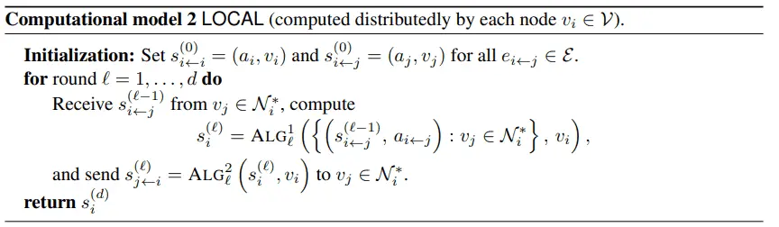
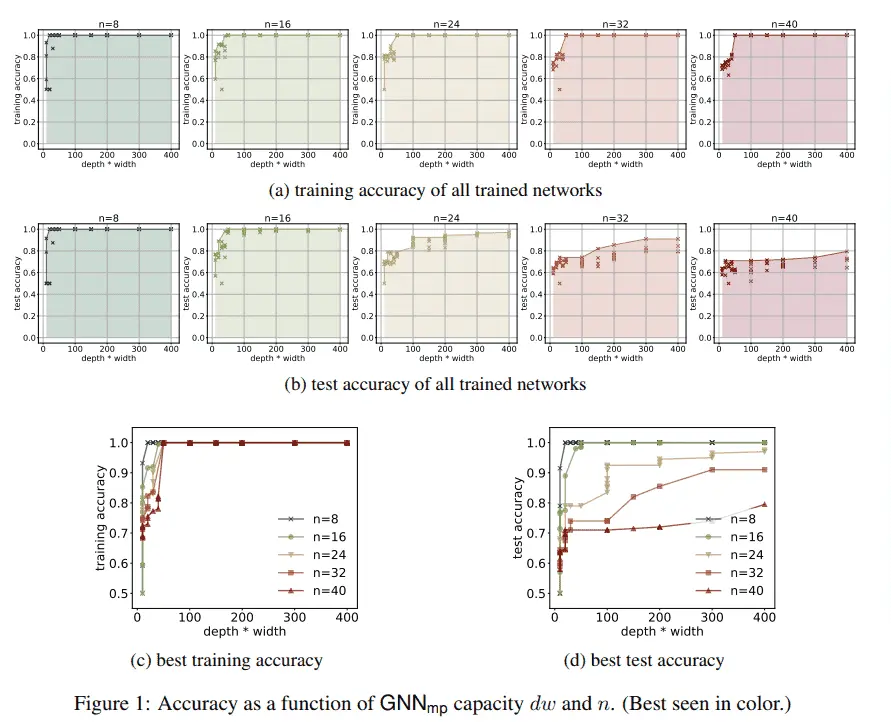
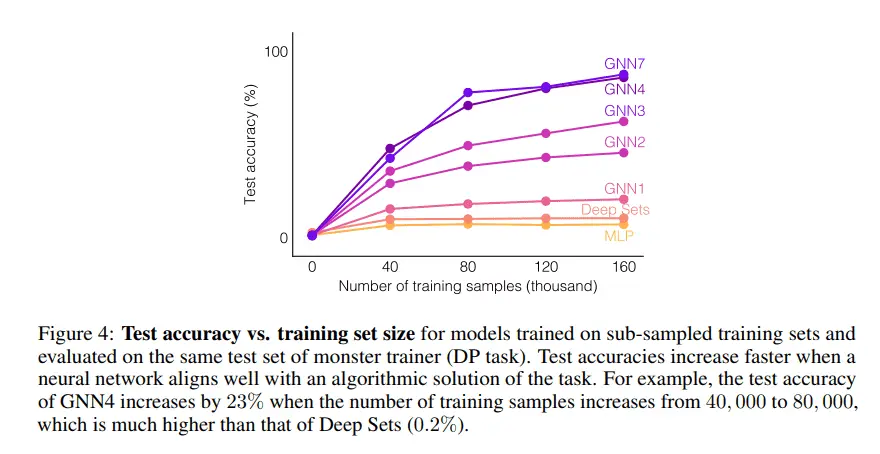
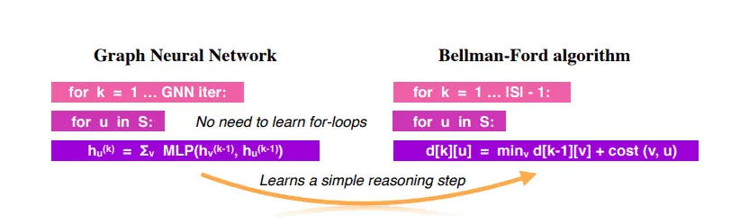

# 文章简介整理
## 2020
### AAAI
#### Cross-Modality Attention with Semantic Graph Embedding for Multi-Label Classification

作者：Renchun You, Zhiyao Guo, Lei Cui, Xiang Long, Yingze Bao, Shilei Wen

摘要：多标签图像和视频分类是计算机视觉中最基本也是最具挑战性的任务。主要的挑战在于捕获标签之间的空间或时间依赖关系，以及发现每个类的区别性特征的位置。为了克服这些挑战，我们提出将语义图嵌入的跨模态注意力机制用于多标签分类。基于所构造的标签图，我们提出了一种基于邻接关系的相似图嵌入方法来学习语义标签嵌入，该方法显式地利用了标签之间的关系。在学习标签嵌入的指导下，生成我们新颖的跨模态注意力图。在两个多标签图像分类数据集(MS-COCO和NUS-WIDE)上的实验表明，我们的方法优于其他现有的方法。此外，我们在一个大的多标签视频分类数据集(YouTube-8M Segments)上验证了我们的方法，评估结果证明了我们的方法的泛化能力。

#### General Partial Label Learning via Dual Bipartite Graph Autoencoder

作者：Brian Chen, Bo Wu, Alireza Zareian, Hanwang Zhang, Shih-Fu Chang

摘要：我们提出了一个实际但有挑战性的问题: 通用部分标签学习(General Partial Label Learning，GPLL)。相比传统的部分标签学习(Partial Label Learning，PLL)问题, GPLL将监督假设从从实例级别（标签集部分标记一个实例）放到了组级别: 1)标签集部分标签了一组实例, 其中组内 instance-label link annotations 丢失, 2)组间的link是允许的——组中的实例可以部分链接到另一个组中的标签集。这种模糊的组级监督在实际场景中更实用，因为不再需要实例级的附加标注，例如，在视频中组由一个帧中的人脸组成，并在相应的标题中使用名称集进行标记，因此不再需要对实例级进行命名。本文提出了一种新的图卷积网络(GCN)——Dual Bipartite Graph Autoencoder (DB-GAE)来解决GPLL的标签模糊问题。首先，我们利用组间的相互关系将实例组表示为dual bipartite图：组内图和组间图，它们相互补充以解决链接的歧义。其次，我们设计了一个GCN自动编码器来对它们进行编码和解码，其中的解码被认为是经过改进的结果。值得注意的是DB-GAE是自监督和转导的，因为它只使用组级的监督，而没有单独的offline训练阶段。对两个真实数据集的大量实验表明，DB-GAEG跟最佳baseline相比有着绝对的提升，0.159 的F1 score和24.8%的accuracy。我们还进一步分析了标签歧义的各个层次。

#### GMAN: A Graph Multi-Attention Network for Traffic Prediction

作者：Chuanpan Zheng, Xiaoliang Fan, Cheng Wang, Jianzhong Qi

摘要：由于交通系统的复杂性和影响因素的不断变化，长期的交通预测具有很大的挑战性。在本文中，我们以时空因素为研究对象，提出了一种多注意力图网络(graph multi-attention network ，GMAN)来预测道路网络图中不同位置的时间步长的交通状况。GMAN采用了一种encoder-decoder结构，其中编码器和解码器都由多个时空注意力块组成，以模拟时空因素对交通条件的影响。编码器对输入流量特征进行编码，解码器对输出序列进行预测。在编码器和解码器之间，应用转换注意力层来转换已编码的流量特征，以生成未来时间步长的序列表示作为解码器的输入。转换注意力机制模拟了历史时间步长与未来时间步长之间的直接关系，有助于缓解预测时间步长之间的误差传播问题。在两个现实世界中的交通预测任务（即交通量预测和交通速度预测）上的实验结果证明了GMAN的优越性。特别地，在提前1个小时的预测中，GMAN的MAE指标提高了4％，优于最新技术。源代码可在https://github.com/zhengchuanpan/GMAN找到。

#### Graph Few-shot Learning via Knowledge Transfer

作者：Huaxiu Yao, Chuxu Zhang, Ying Wei, Meng Jiang, SuhangWang, Junzhou Huang, Nitesh V. Chawla, Zhenhui Li

摘要：对于具有挑战性的半监督节点分类问题，已经进行了广泛的研究。图神经网络(GNNs)作为一个前沿领域，近年来引起了人们极大的兴趣。然而，大多数GNN具有较浅的层，接收域有限，并且可能无法获得令人满意的性能，特别是在标记节点数量很少的情况下。为了解决这一问题，我们创新性地提出了一种基于辅助图的先验知识的graph few-shot learning (GFL)算法，以提高目标图的分类精度。具体来说，辅助图与目标之间共享一个可迁移的度量空间，该空间以节点嵌入和特定于图的原型嵌入函数为特征，便于结构知识的传递。对四个真实世界图数据集的大量实验和消融研究证明了我们提出的模型的有效性以及每个组件的贡献。

#### Learning Cross-Modal Context Graph for Visual Grounding

作者：Yongfei Liu, Bo Wan, Xiaodan Zhu, Xuming He

摘要：Visual grounding是许多视觉语言任务中普遍存在的一个基本单元，但由于grounding实体的视觉和语言特征的巨大差异、强大的语境效应以及由此产生的语义歧义，visual grounding仍然具有挑战性。以前的研究主要集中在学习单个短语在有限的语境信息下的表达。针对其局限性，本文提出了一种languageguided graph representation表示方法来捕获grounding实体的全局上下文及其关系，并针对多短语visual grounding任务开发了一种跨模态图匹配策略。特别地，我们引入一个模块化图神经网络，通过消息传播分别计算短语和目标建议的上下文感知表示，然后引入一个基于图的匹配模块来生成全局一致的基础短语定位。我们在两阶段策略中联合训练整个图神经网络，并在Flickr30K Entities基准上对其进行评估。大量的实验表明，我们的方法比之前的技术有相当大的优势，证明了我们的基础框架的有效性。代码可以在https://github.com/youngfly11/LCMCG-PyTorch 找到。

#### Learning from the Past: Continual Meta-Learning with Bayesian Graph Neural Networks

作者：Yadan Luo, Zi Huang, Zheng Zhang, Ziwei Wang, Mahsa Baktashmotlagh, Yang Yang

摘要：元学习（Meta-learning）用于few-shot learning，允许机器利用以前获得的知识作为优先级，从而在只有少量数据的情况下提高新任务的性能。然而，大多数主流模型都存在灾难性遗忘和鲁棒性不足的问题，因此不能充分保留或利用长期知识，同时容易导致严重的错误累积。本文提出了一种新的基于贝叶斯图神经网络（CML-BGNN）的连续元学习方法。通过将每个任务形成一个图，可以通过消息传递和历史迁移很好地保存任务内部和任务间的相关性。为了解决图初始化过程中的拓扑不确定性问题，我们使用了Bayes by Backprop算法，该算法利用amortized推理网络逼近任务参数的后验分布，并将其无缝地集成到端到端边缘学习中。在miniImageNet和tieredImageNet数据集上进行的大量实验证明了该方法的有效性和效率，与最先进的miniImageNet 5-way 1-shot分类任务相比，性能提高了42:8%。

#### Neural Graph Embedding for Neural Architecture Search

作者：Wei Li, Shaogang Gong, Xiatian Zhu

摘要：现有的神经体系结构搜索（(NAS)）方法往往直接在离散空间或连续空间中进行搜索，忽略了神经网络的图形拓扑知识。考虑到神经网络本质上是有向无环图(DAG)，这会导致搜索性能和效率欠佳。在这项工作中，我们通过引入一种新的神经图嵌入(NGE)思想来解决这个限制。具体来说，我们用神经DAG表示神经网络的构建块(即cell)，并利用图卷积网络来传播和建模网络结构的固有拓扑信息。这导致可与现有的不同NAS框架集成的通用神经网络表示。大量实验表明，在图像分类和语义分割方面，NGE优于最新方法。

#### RoadTagger: Robust Road Attribute Inference with Graph Neural Networks

作者：Songtao He, Favyen Bastani, Satvat Jagwani, Edward Park, Sofiane Abbar, Mohammad Alizadeh, Hari Balakrishnan, Sanjay Chawla, Samuel Madden, Mohammad Amin Sadeghi

### ICLR
#### What graph neural networks cannot learn: depth vs width
机器学习中一个很基础性的问题就是判断什么是一个模型可以学习和不能学习的。在深度学习中，已经有很多工作在研究如RNNs，Transformers以及Neural GPUs的表现力。我们也可以看到有工作在研究普遍意义上的GNNs相关的理论，如以图作为输入的神经网络。普遍性的表述使得我们可以更好地研究模型的表现力。

理论上，给定足够的数据和正确的训练方式，一个这种架构下的网络可以解决任何它所面对的任务。但这并不应该是一切，只是知道一个足够大的网络可以被用来解决任何问题无法使我们合理地设计这个网络，从而另一方面，我们需要通过研究他们的局限来知道获取更多关于这个模型的认知。

本文研究了基于信息传递的图神经网络GNNmp的表达能力，包括GCN，gated graph neural networks等，并回答了如下问题：（1）什么是GNNmp可以计算的？本文证明了在一定条件下，GNNmp可以计算任何可以被图灵机计算的函数。这个证明通过建立GNNmp和LOCAL之间的关系来实现。而LOCAL是一个经典的分布式计算中的模型，它本身是具有图灵普遍性的。简而言之，GNNmp被证明是普遍的，如果满足如下的几个较强的条件，即具有足够多的层数和宽度，节点之间可以相互区分。（2）什么是GNNmp不可以计算的？本文证明了GNNmp的能力会损失很大一部分如果乘积dw被限制。具体的，本文对于以下的几个问题展示了dw的下限，即检测一个图中是否含有一个指定长度的环，确认一个子图是否是联通的，是否包含环，是否是一个二分图或是否具有哈密顿回路等。

本文展现了GNNmp在和合成数据上的实验结果，选取4-cycle分类问题，即将图根据它们是否包含有4个节点的回路来将其分类的问题来检验GNNmp的能力，目的在于验证GNNmp的dw乘积，节点数n和GNNmp解决问题的能力之间的关系。

#### What Can Neural Networks Reason About?
近来，有很多关于构建可以学会推理的神经网络的尝试。推理任务多种多样，如视觉或文本问答，预测物体随时间的演化，数学推理等。神奇的是那些在推理任务中表现较好的神经网络通常具有特定的结构，而很多成功的模型均采用GNN的架构，这种网络可以显示的建模物体两两之间的关系，并可以逐步的通过结合某个物体和其它物体的关系来更新该物体的表示。同时，其他的模型，如neural symbolic programs，Deep Sets等，也都可以在特定问题上取得较好的效果。但是关于模型泛化能力和网络结构之间关系的研究仍然较少，我们自然会问出这样的问题：怎样的推理任务可以被一个神经网络学习到？对这个问题的回答对我们如何理解现有模型的表现力和其局限性至关重要。本文通过建立一个理论框架来回答这个问题，我们发现如果我们可以在这个推理问题可以和这个网络之间建立良好的对应关系，那么这个问题可以被很好地解决。

例如，在Bellman-Ford算法求解任意两点间最短路径的问题上，虽然可以证明MLP可以表示任何GNN可以表示的函数，但GNN的泛化能力更强，而后者决定了GNN的效果更好，或者说，GNN学到了如何去推理。究其原因，GNN可以通过学习一个很简单的步骤，即该算法中的松弛过程，来很好地模拟Bellman-Ford算法，而与此相对应地，MLP却必须去模拟整个for循环才可以模拟Bellman-Ford算法。

