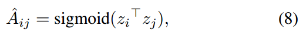
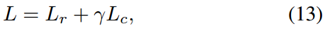

# Attributed Graph Clustering: A Deep Attentional Embedding Approach
## 摘要
图聚类是网络上一种用来发现社区的基本任务，现在的方法集中于在传统聚类方法如k-means上使用深度学习的方法去学习图嵌入。这些两步的框架难以操控且通常得到非最优的效果，最主要的原因是图嵌入不是目标导向（goal-directed）的。因此文章提出了一种目标导向（goal-directed）的深度学习方法*Deep Attentional Embedded Graph Clustering*（DAEGC）。方法应用于属性图，通过应用注意力机制来得到邻居节点对目标节点的重要性。算法那编码了拓扑结构和节点内容，来获得紧密表征。
## Motivation
基于embedding的方法是两阶段的，也就是说用深度神经网络和聚类算法进行学习。问题在于这样习得的embedding并非一定适用于图上的聚类任务，图聚类任务也不一定对图embedding学习有用。因此，需要目标导向的算法，同时得到两个阶段的效果。  

然而，传统的目标导向的训练方法大多数是应用于分类任务的，很少方法是应用于图聚类的。

因此，文章提出了一种目标导向的基于图注意力机制自编码器的属性图聚类框架。
### Contribution
* 提出了第一个图上基于注意力机制的自编码器，同时高效聚合了结构和属性信息；
* 发布了第一个目标导向的属性图剧烈框架，框架同时优化embedding学习和图聚类；
* 实验结果表明算法的效果良好。

## 算法
### 问题定义
G=(V, E, X), V代表节点集合，E代表边集，G的拓扑结构使用邻接矩阵A定义，如果Aij为1代表有边。X代表属性值。

图聚类指的是把图分为k个聚类，聚类内的节点彼此之间在属性上是接近的，也更可能有相似的属性值。框架如图所示：

### Graph Attentional Autoencoder
文章用GAT的变种作为图编码器。Idea是通过聚合邻居来学习每个节点的隐藏表征：

其中，z是节点输出的表征，N是节点的邻居，alpha是注意力系数，含义是节点j对于节点i的重要性。文章分别从属性值和拓扑距离两个角度计算注意力系数。

属性值角度，注意力系数被看作是一个单层的前馈神经网络，网络的输入是节点j和i的属性值：

拓扑结构角度，GAT只考虑了一层邻居，文章则考虑了高阶邻居：

其中，B是转移矩阵，Bij=1/di，如果节点i和j之间没有连边，则Bij=0。di是节点i的度。因此Mij代表的是节点j和节点i以t阶邻居上的拓扑相关度。

注意力机制的计算公式如下：

在引入拓扑权重M和激活函数后，注意力机制可以变为：

现在假设x就是0阶的z，则使用了两层的图注意力机制后，得到embedding的计算公式为：

最终可以得到zi=zi(2)

#### 内积解码器和Loss函数
由于文章使用的embedding已经包含了内容和结构信息，因此选择采用简单的内积解码器来预测节点之间的连边：  

损失函数为：

### Self-optimizing Embedding
聚类算法通常是无监督的，文章提出一种自优化embedding方法。

在优化公式9的同时，文章还将隐藏层embedding输入自优化的聚类算法，最小化目标：

q计算的是节点i与聚类中心embeddingu的相似性，p和q的计算方式分别如下：

### Joint Embedding and Clustering Optimization
联合embedding和聚类优化后的目标函数为：

## 实验
对比算法中仅使用结构或内容的算法：
* K-means
* Spectral clustering
* GraphEncoder
* DeepWalk
* DNGR
* M-NMF

对比算法中同时使用了结构和内容的算法：
* RMSC
* TADW
* VGAE & GAE

实验结果见表格：

