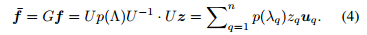
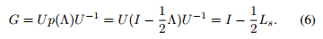
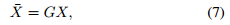
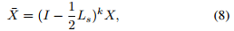
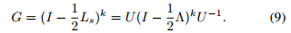
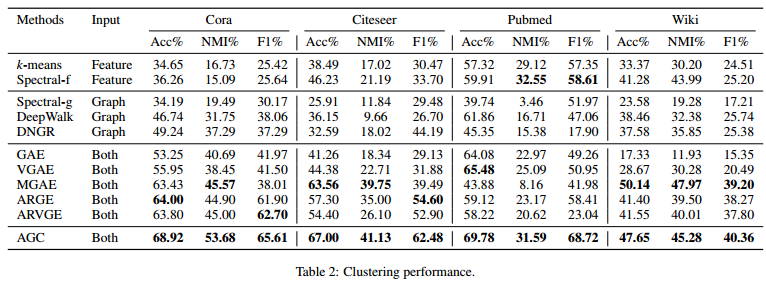

# Attributed Graph Clustering via Adaptive Graph Convolution
## Motivation
* 图卷积应用非常普遍，但是很少研究应用图卷积来最大化聚类表现的。
* 大部分方法没有利用到图上的高阶信息，而且应用多少阶的高阶信息也是一个问题。

因此文章提出了利用了图卷积和自适应高阶信息聚合的方法。

## 算法
### 高阶图卷积
首先图卷积的公式可以写做：

因此一阶的卷积核为：

将卷积核（公式6）应用于特征矩阵后为：

文章定义k阶的图卷积为：

因此对应的卷积核为：

### 自适应选择k阶
为了能够自适应选择k阶，文章定义了聚类的类内距离：

当k从1不断增大时，每一轮都能计算`intra(C)`，当类内距离开始增大时，就停止选择。此时获得了最佳的k。

这个思想跟early stop很像。
## 实验
文章分别在Cora、Citeseer、Pubmed和Wiki上做了实验。实验结果如图：

文章还做了选择k的实验：

