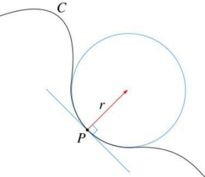
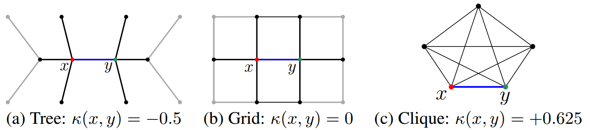

# Curvature neural network
这篇文章发表于2020的ICLR，文章利用曲率来进行节点embedding的计算。边的曲率定义了边之间的距离，这个距离和边的长度是不一样的。首先介绍一下曲率。  
在曲线上，曲率指的是针对曲线上某个点的切向方向角对弧长的转动率，用来表示曲线在某一点的弯曲程度。  
  

涉及到数学理解上比较困难，不过这不是重点，重点是在离散空间即图上，如何定义曲率。文章采用了一种比较粗糙的方法，首先定义$m\_x$为节点x上的概率度量：
$$m_x(x_i) = \\left\\{
    \\begin{aligned}
    \\alpha &    & if x_i=x\\\\
    (1-\\alpha)/k &      & if  x_i \in N(x)\\\\
    0 &    & otherwise
    \\end{aligned}
\\right.$$
$$\alpha是一个超参数$$
通过Wasserstein距离来测量两个节点之间的距离。Wasserstein距离度量两个概率分布之间的距离，指的是把概率分布q转换为p的最小变换的距离。因此，曲率被定义为与Wasserstein距离W(mx, my)比d(x,y)有关：
$$k_{xy}=1-\frac{W(m_x,m_y)}{d(x,y)}$$  
含义如下图，表明不同结构的网络上节点之间的关系：
  

为了计算得到点x，y之间的W(mx, my)距离，对下式进行优化：
$$min_M\sum_{i,j}d(x_i,y_j)M(x_i,y_j) s.t.\sum_jM(x_i,y_j)=m_x(x_i),\forall i;\sum_iM(x_i,y_j)=m_y(y_j),\forall j$$
其中M表示的是沿着最短距离d从点x到y的概率质量的数量。  
接下来介绍一下文章如何在图卷积网络中使用曲率，曲率直观上而言是衡量一条消息流过边缘的难易程度，并应用于控制卷积中的消息，例如，正曲率表示的是在社区内部，负曲率表示的是连接两个不同社区的连边。  
首先GCN的公式可以表示为下式，h是节点feature或embedding，W是权重矩阵：
$$h_x^{t+1}=\sigma_t(\sum_{y \in N(x)} \tau_{xy}^tW^th_y^t)$$
为了得到公式中的
$$\tau_{xy}^t$$
在这里使用MLP多层感知器获得：  
$$\tau_{xy}=softmax^t(MLP^t(k_{xy}))$$
这就是文章提出的**CurvGN-1**。文章还提出了**CurvGN-n**，CurvGN-n考虑将上面的MLP层扩展到多值的版本，以便获得更强的灵活性。  
CurvGN-n是对不同的消息通道不同的权重，同样的也是用MLP来进行学习的：
$$\Gamma_{xy}=softmax^t(MLP^t(k_{xy}))$$
但是聚合特征方面的公式不太一样：
$$h_x^{t+1}=\sigma_t(\sum_{y \in N(x)} diag(\Gamma_{xy}^t)W^th_y^t)$$
其中的diag表示是对角矩阵。  
这篇文章提出了使用数学方法结合神经网络来进行图嵌入的学习，经过实验发现使用曲率能有效的改善embedding的效果。
