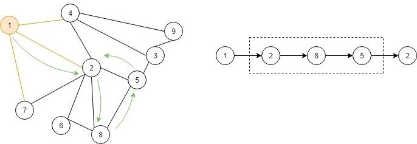
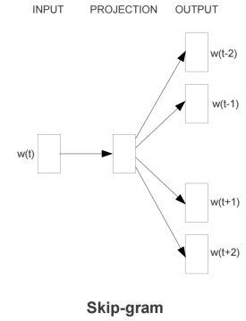
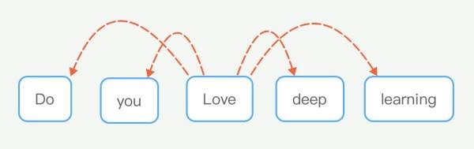
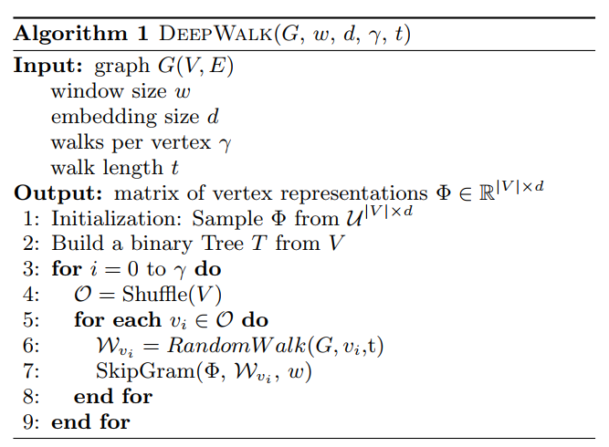

# DeepWalk
网络是具有一定的稀疏性的，稀疏性使得能够设计高效的离散算法，同时也使得统计学习更难以概括。因此，网络学习方法需要能够处理稀疏性。本文介绍了基于深度学习的方法来进行网络表示学习，通过对随机游走获得的序列进行建模来捕获网络节点的社交表示。社交表示就是节点的隐藏特征，这个隐藏特征含有节点的邻居相似性和社区特征。

DeepWalk算法是输入图并输出图的节点隐藏表征的算法，包含两个部分，分别是捕捉网络结构特征的RandomWalk，以及对RandomWalk序列建模的深度学习模型SkipGram。

因此，我们可以得出：

> DeepWalk = RandomWalk + SkipGram
## RandomWalk
  

如图所示，随机游走就是从一个节点出发，随机的向这个节点可以到达的邻居节点进行游走的过程，当达到最大游走轮次时，我们就能得到一条游走序列。随机游走的好处在于，可以并行执行，因为游走的范围仅仅是局部的，且不修改网络结构，因此可以并行执行。另外，随机游走可以自适应支持不同规模的图，具有良好的适应性。
## SkipGram

如上图，SkipGram模型优化的就是当W(t)出现时，其上下文节点出现的概率，即预测某个节点出现时上下文节点出现的概率大小，再用下图来帮助理解。

也就是预测当Love出现时，Do、you、deep、learning等词的出现概率，这样，当其他类似的句子出现时，例如Do you enjoy deep learning，就很容易发现love与enjoy之间的相似性，因此求得的love和enjoy的embeddings也应该是相似的。

SkipGram采用的输入是one-hot编码，也就是只有一位为1，其他都为0的编码方式，在模型训练后，当输入one-hot编码时，可以从隐藏层中获得embeddings。原因就是当上下文接近时，隐藏层的权重是相当接近的。

## 算法
理解了上面，算法也就不难理解了。  

