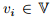
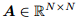
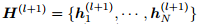
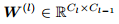
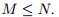

# DropEdge: towards deep graph convolutional networks on node classification
## Motivation
Over-fitting和Over-smoothing问题是GCN等网络发展中的一大掣肘。
* Over-fitting：在有限的训练数据中，使用过多的参数，过深的神经网络来拟合，容易导致模型过拟合；
* Over-smoothing：Over-smoothing则是另一个极端，使得训练GCN非常困难。在极端情况下，所有节点的表示将收敛到一个固定点，从而导致其与输入特征无关，梯度消失，这就称为过度平滑。

以上两个问题可以使用本文提出的方法，DropEdge来避免。DropEdge指的是在每一次训练中随机删除固定比例的边。主要有以下几个好处：
1. 可以将DropEdge视作数据增强技术，通过DropEdge，实际上是在生成原始图的不同随机变形副本，这样，增加了输入数据的随机性和多样性，因此可以更好的防止过拟合；
2. DropEdge可以视作消息传递缩减器。在GCN中，相邻节点之间传递的消息是沿着边缘路径进行的，删除某些边缘使节点连接更加稀疏，因此在GCN变深时某种程度上防止了过度平滑。

文章还提到JKNet方法使用的密集连接也可以防止过度平滑，JKNet将每个隐藏层紧密的连接到顶层，因此仍保留了低层的特征。文章的方法可以提高JKNet的性能。

简单来说，本文的DropEdge是灵活通用的一种增强数据的方法。

## 方法
### 符号定义
定义为输入图，节点的大小为**N** ，边是。节点特征定义为，邻接矩阵：，度：。定义矩阵**D** 的对角线是从**d** 中得到的。

GCN的公式定义为：

其中，是隐藏层的向量，则是邻接矩阵的正则化，是矩阵**A+I** 的对应度矩阵；是非线性的激活函数；则是权重矩阵。

文章将公式(1)看做是Graph Convolutional Layer（GCL）。

### 方法过程
在每次训练中，DropEdge都会随机删除输入图的固定比例的边，假设删除邻接矩阵**A** 中**Vp** 个非空的元素，**V** 是边的总共数量，**p** 是删除的比例。因此删除了边的邻接矩阵定义为：

**A‘** 是删除了Vp个边的新的邻接矩阵。

为了防止过拟合，DropEdge还产生了一些扰动，因此会对输入数据产生不同的随机变形。有效果的原因是，GCN会汇总每个节点的邻居信息，相当于对邻居特征进行加权求和，使用随机变形的扰动后，如果我们以概率p丢弃一些边，那么计算邻居聚合的期望也要乘以p，在权重归一化后，实际上会删除这种乘数。因此DropEdge不会改变对邻居聚合的期望。

实际上，可以为每个单独的GCL层执行DropEdge步骤，这样会带来更多的随机性和变形。

### 防止Over-smoothing
首先过度平滑意味着节点特征随着网络深度的增加而收敛到固定点，这将导致深层的GCN的输出限制为仅与图拓扑相关，而与输入节点特征无关，会损害GCN的表达嫩那里。本文使用子空间的概念进行更广泛的介绍。

* **定义1（子空间）** ：定义为上的M维的子空间，其中是正交的，且
* **定义2（平滑）** ：定义对GCN是有效的，如果所有的隐藏层的在子空间M上的距离小于，定义为：
  
* **定义3（平滑层）** ：给定子空间M和，满足公式3的最小值的神经网络层为平滑层。

文章从两个角度证明了DropEdge缓解了平滑的问题：1. 减少节点连接使得DropEdge可以减缓过度平滑的收敛；2. 原始空间和收敛以后的子空间。

具体的证明过程这里不再概述。

### 讨论
* **DropEdge vs. Dropout**: Dropout是将矩阵维度随机设置为0来扰动的，可能会减少过拟合，但对过度平滑没有帮助；
* **DropEdge vs. DropNode**：一些基于采样的方法如GraphSage、FastGCN等，在这里称为DropNode，DropNode采样了子图，没有被采样到的节点的边也被删除了，因此可以看做是DropEdge的特定形式。由于采样影响了节点和边，性能会更差，灵活性也不如；
* **DropEdge vs. Graph-Sparsification**： 图稀疏化是在保留输入图的所有信息的同时，消除图压缩不必要的边缘，这显然是DropEdge的目标不需要的地方。具体而言，图稀疏化需要使用繁琐的优化方法来确定要删除的边，且删除边后输出图将保持不变。

## 实验

