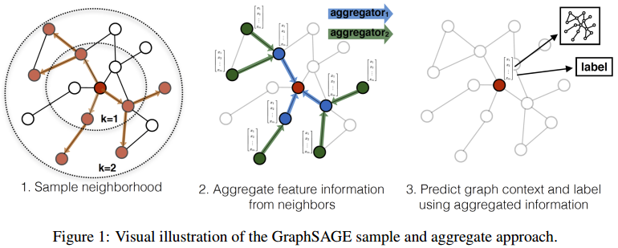
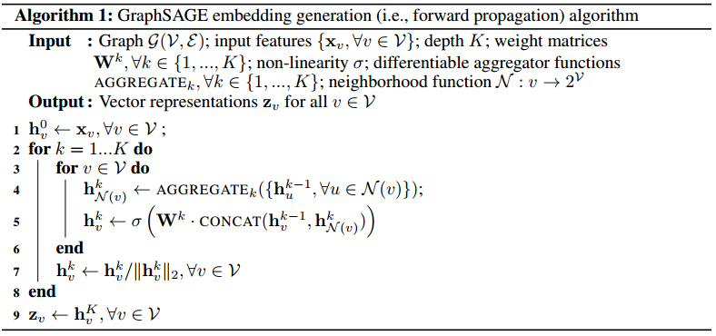
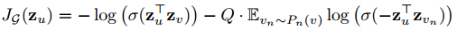

# GraphSAGE
GraphSAGE是为了解决GCN无法处理inductive的问题，inductive指的是可以解决多个不同图之间的embedding学习问题。另外，GraphSAGE采用了采样策略，而非聚合所有节点的信息。  
  

## 算法
GraphSAGE的算法是非常简单的，多次迭代，每次迭代中聚合邻居信息，聚合后的信息通过神经网络输出本次迭代的节点embedding。  
  

从算法中可以看到，AGGREGATOR是算法是非常重要的一部分。文章中提出了三种不同的聚合器，分别是MEAN聚合器、LSTM聚合器、Pooling聚合器。  
### 损失函数
算法使用的函数是交叉熵损失函数：  
  
