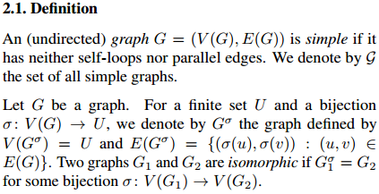
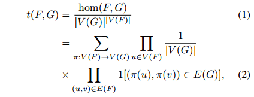
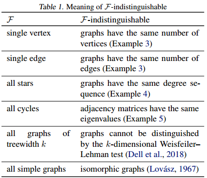

# Graph Homomorphism Convolution
## 摘要
本文从图的同态性角度研究**图分类** 问题。文章考虑了从F到G的同态数，其中G是感兴趣的图，F属于某些图族。文章证明了图同态数提供了一个自然的普遍一致性的嵌入映射。实践中，通过选择具有约束的树宽的F，文章证明同态数方法在分类精度和运行速度上效果都更好。最终，文章提出了Graph Homomorphisms Convolution模块，模块在图形分类任务中具有良好的性能。

## 无特征图
文章首先在没有顶点特征的图上建立框架。在没有顶点特征的图中，通常只捕捉结构信息。

### 定义


### 同构数/同态数
同构数来源于[Hell, P. and Nesetril, J. Graphs and homomorphisms. Oxford University Press, 2004.](http://lib-phds1.weizmann.ac.il/vufind/Record/000094849)。

让F和G代表无向图。从F到G的同构定义为函数π：V(F) -> V(G)，这保存了边的存在性，例如图F内的边(u,v)通过函数π可以得到边(π(u), π(v))在图G中存在。定义Hom(F, G)代表所有从F到G的同构集合。hom(F, G)是集合Hom(F, G)的基数。

考虑同构/同态密度t(F, G)，归一化版本如下：



其中，公式(2)中的1[·]指的是艾佛森括号，含义是方括号内的条件满足时为1，否则为0。公式2可以看做是在G中随机抽样的顶点，且这个顶点保存了边的概率。直观而言，一个同态数hom(F， G)用模式图F聚集了G的局部连接信息。

```
定理6：对图G1和G2，当且仅当hom(F, G1)=hom(F, G2)时图G1，G2是同构的。
```

### 使用同态数作为嵌入
由于同态数具有不变形，文章使用同态数作为图嵌入向量。文章选择一个子集F⊆G作为图嵌入参数，通过堆叠同构数来得到嵌入向量：hom(f, G)=[hom(f, G): f ∈ F] ∈ R。

在这里文章只考虑理论上的评价，实验则放在后面进行验证。文章主要关注表达能力和计算效率。

如果hom(F, G1)=hom(F, G2)，则两个图对于所有的f∈F都是F不可区分的。定理6意味着F不可分性将图同构性泛化。对于几个类F，F不可分性的解释的结果如下：



如果对于所有的F不可分图G1和G2满足f(G1)=f(G2)，则函数f：g -> R是 F不变的。因此，如果我们使用F同构性作为嵌入，我们只能表达F不变函数。实践中，F应该选择尽可能小的值，这样目标假说可以被假定为F不可变的。

下面证明任何连续的F不可变函数都可以被F同构性嵌入的函数任意精确近似。

### 表达能力：普遍性定理
我们首先对使用F同构数进行表征的函数进行特征化，得到两个结果。

```
定理7：令f为F不可变函数。对任意的正整数N，存在关于hom(F, G)的度N的多项式hN，使得f(G)≈hN(G)，对于所有的G使得|V(G)|≤N。
```

```
定理8：令f为连续的F不变函数，存在关于hom(F, G)的度N的多项式使得对于所有的G，f(G)≈hN(G)。
```

定理7是针对有界尺寸的图（bounded size graphs）的普遍逼近定理。值得注意的是，张量图神经网络在有界尺寸的图上的不变形/等效性的普遍性结果已经被[(Keriven & Peyre ´, 2019)](https://www.baidu.com/link?url=R_fbdgVVRmjJ5uleA1Tx2umxJ7kqUh2jH_nAUC2AgNuqOOCoQoOo4CW-pXdxU76P&wd=&eqid=ea77eda3000ea591000000065ec542a7)证明了。非约束（unbounded）仍然是一个开放的问题。定理8是一个对所有图的统一近似。这些是对前人工作的改善。然而，文章的定理仅适用于连续函数，这意味着拓扑空间满足Stone-Weierstrass定理的条件。

令X为一组点。存在一组函数A，仅在函数h∈A且h(G1)≠h(G2)时A可以划分X，对于每个不同的点G1，G2∈X。

```
定理9（Stone–Weierstrass定理）：令X为一个紧凑的豪斯多夫空间，C(X)是从X到R的连续函数的集合。如果子集A⊆C(X)可以分割X，那么A的多项式集合在C(X)中是紧密的。
```

```
定理10（紧致性定理）：具有切割距离δ的图元空间G是紧凑的Hausdorff空间。
```

```
定理11：任何连续的F不变量函数f: g -> R 是任意精确地近似于{t(F, ·) : f ∈F}的多项式。
```

### Computational Complexity: Bounded Treewidth
