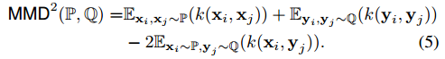

# Graph Neural Networks with Composite Kernels
图神经网络通常使用节点聚合方案来捕获邻居信息，而大多数聚合方案会平等地对待图中的所有链接，而忽略了节点特征的相似性。本文从内核权重的角度重新解释了节点聚合，并提出一种在聚合方案中考虑特征相似性的框架。具体而言，归一化的邻接矩阵等效于基于邻居的内核矩阵，文章还提出特征聚合基于原始邻居的内核和可学习的内核。最后文章进一步展示了方法如何扩展到GAT。
## 方法
### 核函数
核函数指的是把一对数据映射到一个值的函数，优点在于它可以通过计算无穷维空间中数据对之间的相似性，来描述它们之间的非线性关系。

例如：正半定核是其矩阵为正半定的核函数，可用于计算两个概率测度的相似性，例如通过最大均值误差（MMD）：

### 算法
#### GCN
文章认为正则化的邻接矩阵可以看做是核矩阵。然而，GCN的核并非确定的，仅编码了邻域信息。文章认为这个核不考虑节点特征，因此是受限的。为了克服限制，文章提出了一种复合内核框架：

K' = K · A

其中，·指的是逐元素乘法，K是核矩阵，A是邻接矩阵。使用K'替代A来进行图卷积的计算。
