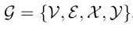
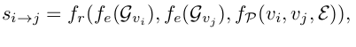
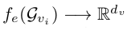
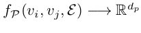
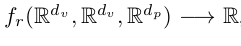
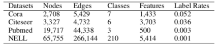
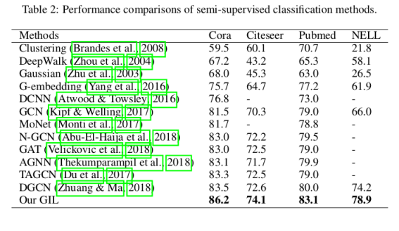

# Graph inference learning for semi-supervised classification
文章来自ICLR2020。
## 摘要
在这项工作中，文章解决了图数据的半监督分类问题中从有标记节点以及图结构推断出那些未标记节点的标签。最近的工作通常使用传统的监督学习并通过高级图卷积来解决此问题，但是当标签数据不足时，性能可能会大大降低。为此，文章提出了一种图推理学习（GIL）框架，通过学习图拓扑上的节点标签推理来提高半监督节点分类的性能。为了联系两个节点，文章通过将节点属性，节点间路径和局部拓扑结构封装在一起来正式定义结构关系，从而可以方便从一个节点推导到另一个节点。为了学习推理过程，文章进一步介绍了从训练节点到验证节点的结构关系的元优化（meta-optimization），从而提高图推理能力，使得算法可以更好地应用于测试节点。在四个基准数据集（包括Cora，Citeseer，Pubmed和NELL）上进行综合评估表明，文章提出的GIL比半监督节点分类任务中的最新方法相比更具有优越性。  

从摘要可以看出最重要的一点，文章提出的算法，将节点属性（特征）、节点间的路径和局部拓扑结合起来定义节点的结构关系，从而可以从一个节点推断出另一个节点。
## 背景
现有的CNN很成功，但是CNN受限于半监督框架，并且缺乏图上有效的推断机制，因此效果受到影响，特别是在有标签数据比较少时。虽然很多方法效果不错，但没有研究在图上如何从一个节点推断出另一个节点。  
文章提出了一个图推断学习的方法，指导模型从具有标记的节点推断无标签节点，最终在有标记节点数量较少的情况下，提高半监督节点分类的性能。文章尝试建立节点间关系来实现推断，节点间关系是通过节点属性、节点之间的可达路径以及局部特点来建立的。文章的主要贡献在于：  
1. 提出了GIL图推理学习框架，建立结构关系，以端到端的方式推断未知节点的标签；
2. 引入元学习（meta-learning）优化；
3. 在引文网络数据集（Cora、Citeseer和Pubmed）和知识图谱数据集（NELL）上对方法进行评估。
## 算法
算法方面因为存在一些公式，这里只讲思想。  
首先是问题定义，定义了标准的图的符号：  
  

含义是，图={节点，连边，节点属性，节点标签}。  
然后定义了节点i和j之间的相似性分数：  
  

其中各项的含义分别为：  
节点表征，文章是使用卷积操作计算的：  
  

路径可达性，使用随机游走：  
  

结构关联性：  
  

可以看到，节点之间的相似性分数是通过两个节点的表征和路径可达性进行计算的。文章使用了meta-optimization的思想，在训练集上进行训练，在测试集上进行微调，改善算法效果。
## 实验
 文章测试了Cora、Citeseer、Pubmed、NELL四个数据集：  
  

这里只放出节点分类的效果：  
  