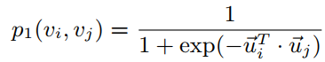
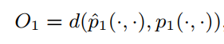
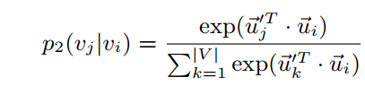
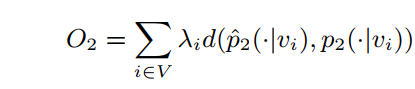

# LINE
LINE原文名字叫做LINE: Large-scale Information Network Embedding。

文章和DeepWalk以及node2vec的算法不同，它不是采用的SkipGram等模型进行embeddings计算的算法。LINE是利用了BFS的方式，主要考虑优化一阶相似性和二阶相似性，来优化节点的特征表示，从这个角度而言LINE与SDNE等算法比较相似。

## 问题定义
LINE中定义了如下几个概念。  

> 定义1：（信息网络）信息网络就是拥有节点（代表数据对象）和节点之间的连边的网络。边可能拥有权重，也可能没有，同时，边可能具有方向，也可能是无向边。

> 定义2：（一阶相似性）指的是网络上两个节点的局部相似性，如果两个节点有连边，一阶相似性就为1，否则为0。

> 定义3：（二阶相似性）指的是两个节点的邻居网络结构的相似性，如果两个节点的邻居节点都不具有一阶相似性，则这两个节点也不具有二阶相似性。

> 定义4：（大规模信息网络嵌入）给定大规模信息网络，对网络中的每个节点都计算低维表征，就是大规模信息网络嵌入。
## LINE
下面介绍一下LINE是如何保存一阶相似性和二阶相似性的。
### 一阶相似性

如上图公式，在LINE中，节点为`vi`，`vj`，那么`ui`和`uj`分别为向量表征，公式的含义是节点空间上的节点分布，也就是说，我们可以通过优化节点空间上的节点分布来获得最好的向量表征，即`ui`和`uj`。最直接的利用距离的方式如下：

我们可以通过优化当前的节点分布和最佳分布的距离，减少这个距离的方式就是改变公式的输入参数，也就是节点的表征（embeddings），这样来获得最能够保存一阶相似性的节点embeddings。LINE原文用于衡量节点分布相似性的方法是KL散度，有兴趣的同学可以阅读原文。

### 二阶相似性

如上图，带有一撇的`u`指的是当节点为上下文时的embeddings。二阶相似性就是在优化节点的周围邻居出现的概率，按照距离的方式，我们可以得到：

因此同样的可以通过优化节点的embeddings，来优化节点的二阶分布的保存效果。原文中的方式还是KL散度。

## 总结
上面的表述过分简单了，可能会造成误解，其实上面的公式定义就相当于损失函数，输入公式的是节点的embeddings。通过一阶和二阶的优化，可以得到较好的节点embeddings。
