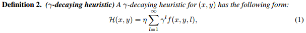
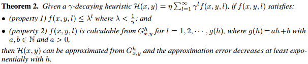
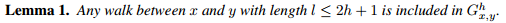
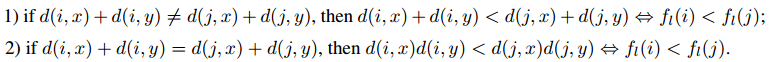
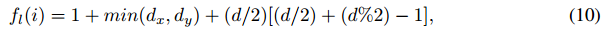
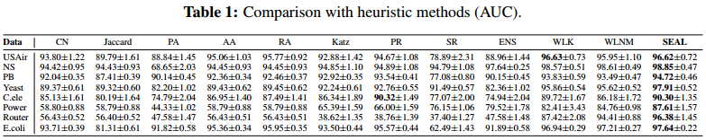
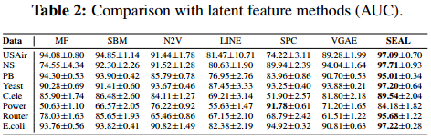

# Link Prediction Based on Graph Neural Networks
## 摘要
链接预测是网络结构化数据的一个关键问题。链路预测启发式方法使用一些得分函数，如共同邻居和Katz指数等来衡量链路的可能性。由于它们的简单性、可解释性，以及对其中一些启发式方法的可扩展性，因此获得了广泛的实际应用。然而，每一种启发式都有一个很强的假设，即两个节点何时有可能链接，这导致了它们在这些假设失效时的网络上链路预测的效果不好。在这方面，更合理的方法应该是从给定网络中学习一个合适的启发式，而不是使用预定义的启发式。通过提取每个目标链路周围的局部子图，我们的目的是学习一个将子图模式映射到链路存在的函数，从而自动学习一个适合当前网络的 "启发式"。在本文中，我们研究了这种用于链接预测的启发式学习范式。

首先，我们提出了一种新颖的γ-衰变启发式理论。该理论将各种启发式学习统一到一个框架中，并证明所有这些启发式学习都可以从局部子图中很好地逼近。我们的结果表明，局部子图保留了与链路存在相关的丰富信息。其次，基于γ-衰变理论，我们提出了一种新的方法，利用图神经网络（GNN）从局部子图学习启发式。其实验结果显示出了前所未有的性能，在多种问题上都能稳定地工作。

## 介绍
链接预测就是预测网络中的两个节点是否有可能存在链接。一些简单而有效的链接预测方法被称为启发式方法，例如共同邻居、Katz等，这些方法使用预设的假设来预测节点之间的链路。因此一旦假设失效，预测效果也会变差。

启发式算法可以看成是预定义的网络结构特征，那么可以从网络自动学习这些特征。文章[Weisfeiler-lehman neural machine for link prediction](https://dl.acm.org/doi/10.1145/3097983.3097996)首先研究了如何从网络中自动学习网络的特征。他们提取了围绕链接的局部包围子图作为训练数据，并使用全连接神经网络来学习哪些包围子图对应于链接的存在。他们的方法被称为Weisfeiler-Lehman神经机（WLNM），取得了最先进的链接预测性能。一个节点对(x;y)的包围子图是由x和y的邻居联合到h跳的网络诱导出的子图。

然而**有研究表明，高阶启发式的性能往往会更好** 。为了有效学习高阶特征，可能需要较大的跳数h，这会引起更大的时间消耗和内存消耗。而本文则证明不一定需要非常大的跳数h来学习高阶图结构特征。文章深入研究了链路预测启发式学习的内在机制，发现**大多数高阶启发式学习可以由一个γ衰变理论统一** 。文章证明，在温和的条件下，任何γ衰变启发式都可以从一个h-hop包围的子图中有效地近似。

基于上面这个理论，文章出了一个新颖的链接预测框架SEAL，从局部包围子图中学习一般的图结构特征。SEAL修复了WLNM的多个缺点。首先，使用图神经网络（GNN）取代了WLNM中的全连接神经网络，实现了更好的图特征学习能力。其次，SEAL不仅允许从子图结构中学习，还允许从潜伏节点和显式节点特征中学习，从而吸收多种类型的信息。

文章的贡献为：
1. 我们提出了一种新的学习链路预测启发式理论，证明了从局部子图而非整个网络中学习的合理性。
2. 提出了SEAL，一种基于GNN的新型链接预测框架。

## Preliminaries
### 符号定义
令G=(V;E)为无向图，V是顶点，E是观察到的连边，邻接矩阵为A。当且仅当节点i和j之间存在连边时，A(i,j)=1。令 Γ(x)为节点x的一阶邻居，d(x, y)为节点x和y支架你的最短路径。随机游走w=<v0, ... vk>，长度为|<v0, ... vk>|。
### 隐藏特征和显式特征
隐藏特征方法将网络的矩阵表示进行因子化，以学习每个节点的低维表征，如matrix factorization、stochastic block model、DeepWalk、LINE、node2vec等。

显式特征则为节点的属性特征。

### 图神经网络GNN
本文不是对GNN的创新，而是一种新型应用。简单介绍一下GNN：GNN通常包括图卷积层、图聚合层。
### 有监督启发式学习
之前有一些关于链路预测的监督启发式学习的尝试。最接近文章的工作是Weisfeiler-Lehman神经机器（WLNM），它也是从局部子图中学习。然而，WLNM有几个缺点。首先，WLNM在子图的邻接矩阵上训练一个全连接神经网络。由于全连接神经网络只接受固定尺寸的张数作为输入，WLNM需要将不同的子图截断到相同的尺寸，这可能会丢失很多结构信息。其次，由于邻接矩阵表示法的限制，WLNM无法从潜伏特征或显式特征中学习。第三，理论上也缺少理论依据。

另一个相关的研究思路是在不同启发式的组合上训练一个监督学习模型。例如，路径排名算法对不同路径类型的概率进行逻辑回归训练，以预测知识图中的关系。Nickel等人提出将启发式特征结合到张量因子化模型中。然而，这些模型仍然依赖于预定义的启发式算法--它们无法学习一般的图结构特征。


## 链路预测启发式的统一性理论
本届旨在更深入地理解各种链路预测启发式背后的机制，从而激发从局部子图中学习启发式的想法。

```
定义1（封闭子图）：对于图G=(V,E)，给定两个节点x,y∈V，第h跳的封闭子图Gh是通过节点集{i | d(i,x) ≤ h 或 d(i, y) ≤ h}从G中推导的。
```

由于Gh包含所有x、y的h跳邻居，因此存在下面的定理。

```
定理1：任何(x, y)的h跳启发式可以从Gh中准确计算得出。
```

下面分析学习高阶启发式的方法，首先通过定义γ-衰减启发式。文章将表明，在一定条件下，γ-衰落启发式可以很好地从h-跳的包围子图中近似。此外，我们将证明几乎所有著名的高阶启发式都可以统一到这个γ衰变启发式框架中。



γ是一个范围从0到1的衰减系数，η是一个正常数或γ的正函数，即是一个常数的上界，f是给定网络下x，y，l的非负函数。





## SEAL：基于GNN的一种理论实现
本届介绍SEAL框架，框架通过学习一般的图解钩特征来进行链路预测，包含三个步骤：
1. 包围子图提取；
2. 节点信息矩阵构建；
3. GNN学习。

目标是自动学习启发式，在理论结果的启发下，这个函数使用局部包围子图作为输入，输出链接存在的可能性。为了学习这样的函数，文章在包围子图上训练一个神经网络。第一步是采样正链接（观察到的）和负链接（未观察到的）的包围子图来构造训练数据。

GNN通常使用(A, X)作为输入，A是邻接矩阵，X是节点信息矩阵。SEAL的第二部是构造每个包围子图的节点信息矩阵X。节点信息矩阵X有三个部分：结构化节点标签、节点嵌入和节点属性。

### 节点标签
在包围子图上，每个节点有一个正整数标签。目的是标记节点在包围子图上的不同角色：
1. 中心节点x和y是链接之间的目标节点；
2. 与中心节点相对位置不同的节点对链接的结构重要性不同。

一个适当的节点标签应该能体现上述不同，否则GNN难以预测。

文本的节点标记方法基于如下标准：
1. 两个目标节点x和y拥有显著标签；
2. 节点i和j在d(i,x)=d(j,x)且d(i,y)=d(j,y)时拥有相同的标签。

基于上述标准，文章发布了Double-Radius Node Labeling（DRNL）方法：首先为节点x和y赋予标签1。接着对任何的满足条件(d(i,x), d(i,y))=(1, 1)的节点i赋予标签2。对半径为(1, 2)或(2, 1)的节点赋予标签3。半径为(1, 3)或(3, 1)的节点得到4。(2, 2)的节点得到5，依次类推。最终标签满足条件：



DRNL的有时在于拥有哈希函数：



### 融合潜在和显性特征
除了节点标签外，还需要融合节点的嵌入和属性特征。

生成节点嵌入是非常简单的。假设给定观察到的网络G=(V,E)，以及正连边Ep，负连边En。如果直接生成嵌入，节点嵌入会记录训练链接的链路的存在性信息。文章观察到GNN可以很快找出链路存在信息，并且只拟合这部分信息进行优化，导致泛化性能不好。诀窍是在E中暂时的添加部分不存在的边。

## 实验结果



