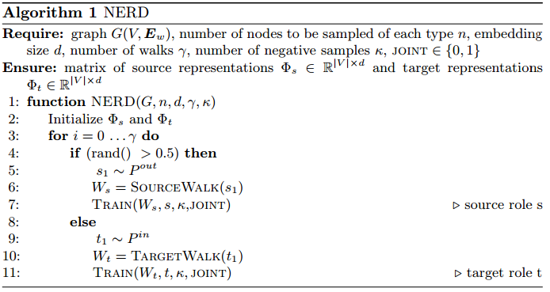
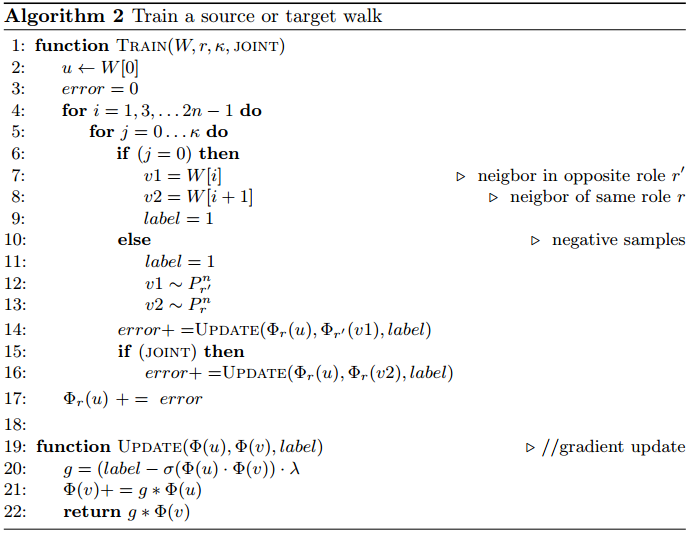
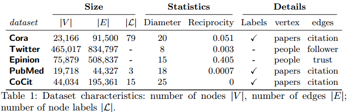
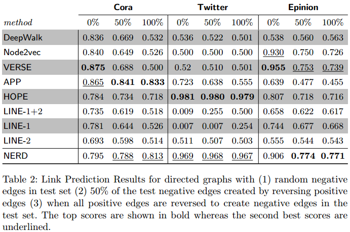
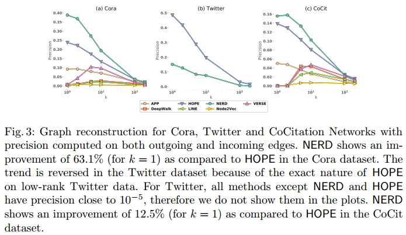
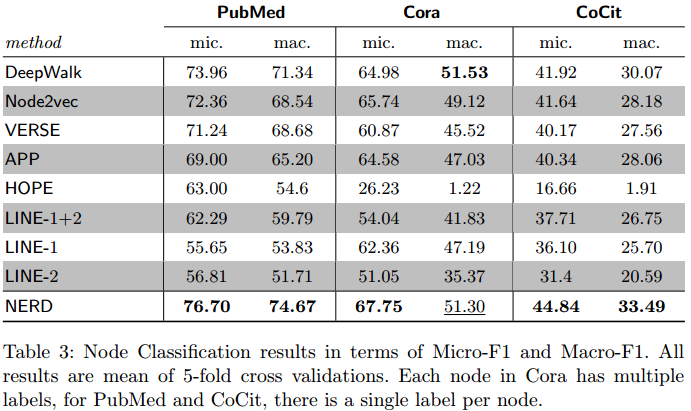

# Node Representaion Learning for Directed Graphs
文章提出了一种在有向图上学习节点表征的方法，使用简单的交替行走策略，生成了特定角色的节点邻居，这里的特定角色指的是游走时的出发节点和游走进入的目标节点。

文章还挖掘了以前的工作在对有向图评估的限制，并提出了一种评估有向图的链路预测和图重构的清晰思路。

文章认为大多数的节点嵌入方法都集中于无向图，很少利用到有向的设置。这些方法存在以下限制：
1. 大多数这些节点嵌入方法都在单个嵌入空间上运行，并且空间中的距离被认为是对称的。导致无法发现有向图中节点是不对称的；
2. 其次，一些方法使用两个嵌入空间来克服限制1，却无法区分有向邻域，有向邻域可以基于可达性来区分这些邻域；
3. 最后，一些方法依赖于邻近度量决定的邻域定义，无法推广。而且这些方法依赖于矩阵分析技术，也难以缩放到大型图上。

文章的贡献在于，提出了一种鲁棒且可推广的方法（NERD），用于学习有向图，方法重视了方向性。NERD方法目的在于保留节点邻域可能性最大的表示形式。不同之处在于方法可以判断出那些是源节点，那些是目标节点。这里我理解的源节点指的是比如从节点v到节点u有有向边(v, u)，那么v就是源节点，u就是目标节点。假设从u游走到v，路径为(u, v)，这个边实际上是不存在的，是为了算法的运行添加的虚拟边。

文章还提出了交替步行策略，指的是在源节点和目标节点之间交替进行游走。最后文章发觉了早期工作在有向图模型评估中的局限性，并为有向图中的链路预测和图重构任务提出了新的评估策略。
## 模型
### 交替随机游走
```
定义一：源游走
给定有向图，定义长度为k的源游走包含一系列的节点：v1, v2, vk+1。如果i是奇数则存在边(vi, vi+1)，如果i是偶数则存在边：(vi+1, vi)：v1 -> v2 <- v3 -> ...
```

```
定义二：目标游走
长度k的目标游走，是从一个入边开始的，假设包含一系列的节点：v1, v2, vk+1。如果i是奇数则存在边(vi+1, vi)，如果i是偶数则存在边：(vi, vi+1)：v1 <- v2 -> v3 <- ...
```

为了生成交替随机游走，首先在图的入度分布和出度分布中为源游走和目标游走采样了输入节点，然后模拟源随机游走和目标随机游走。
### 使用计算图的学习框架
文章认为，两个顶点可能通过三种方式彼此相似：(i)作为出发点；(ii)作为到达点；（iii）作为出发到到达的节点。NERD通过交替随机游走从原始图中提取这三种类型的计算图，来优化一阶邻近度。NERD是通过交替游走来优化这三种计算图中的一阶相似度。具体而言：
1. 从源节点到目标节点的有向边；
2. 从源节点到源节点的无向边；
3. 从目标节点到目标节点的无向边。

这里的目标都是求得节点之间的相似性。算法过程如下：





## 实验
实验采用的数据集：



### 链路预测
本文算法不仅要预测节点之间是否有连边，还要预测连边的方向。因此对于链路预测中节点的测试拆分需要进行一些修改，使得允许负边的存在。下表列出了在数据集上链路预测的ROC-AUC评分：



### 图重建
图重建任务评估嵌入如何保留邻域信息。以前的工作中有两种不同的图重建评估机制：1. 边缘中心评估：从原始图形中随机抽取节点对到其测试集中，然后根据这些候选边缘在嵌入空间的相似性进行排序；2. 以节点为中心评估：对于具有度k的节点，使用嵌入对节点进行k近邻搜索，并基于这个过程能够提取多少实际邻居来计算精度。

文章认为以边缘为中心评估会遇到稀疏性问题，因此采用以节点为中心的评估方法。结果如图：



### 节点分类

