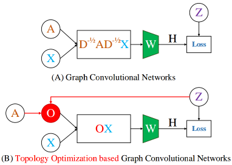
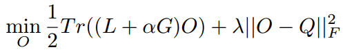

# Topology Optimization based Graph Convolutional Network
文章的motivation是GCN没有完全应用到网络拓扑的潜能，以及灵活性也被限制，因此提出了通过调整网络拓扑来利用到网络拓扑信息以及改善网络的灵活性的TO-GCN方法。  
文章认为一个更清晰的网络（社区）结构可以改善半监督节点分类的效果，因此文章利用节点标签来改善网络拓扑结构。  

主要思想是把网络现有的邻接矩阵根据标签（训练集）优化为新的拓扑矩阵，表示相同标签的节点之间有连边。然后将新的拓扑矩阵替代GCN模型中与拓扑有关的部分，如下图：  
  

优化获得新的拓扑矩阵的思想是已知部分节点的标签可以构建一个矩阵G和Q，矩阵G中为1的部分代表不同节点之间的标签不同，矩阵Q中为1的部分代表不同节点之间的标签相同。G乘以超参数后与拉普拉斯矩阵L=D-A相加，并乘以优化目标矩阵O，将结果的对角线求和得到迹。迹与O-Q的矩阵范数的平方求和。优化后得到O：  
  

这篇文章的优点在于利用了现有标签优化修改了网络的结构，缺点在于这种方式如果标签数量较少可能效果影响较大。
