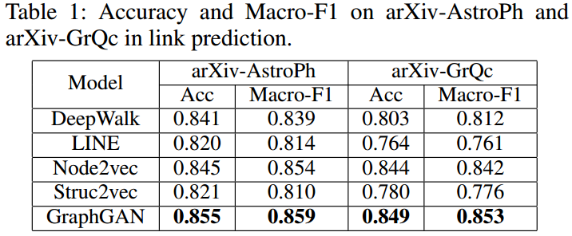

# 链路预测
链路预测（link predction）指的是，预测网络上两个节点之间是否有连边，定义如下：

```
定义：链路预测
给定节点i、j，预测i与j存在链接的可能性或将来链接的可能性。
```

有时link prediction也被称为：
1. Edge Embedding/Classification
2. Relational Inference/Reasoning
3. Graph Generation
## 分类
### 网络类型
* 单层静态网络
* 多层动态网络

### 连边类型
* 加权网络
* 有向网络
* 二部分网络：异性关系网络、疾病网络（症状、基因）、电子商务网络（用户、商品）
* 超网络：一条边连接多个点

### 预测任务
* 预测缺失链路：原本存在但由于采样误差导致没有被观察到
* 预测虚假链路：原网络中存在噪声或有些边本不存在
* 预测新增链路：随着时间发展网络中可能出现的新连边
* 预测消失链路：随着时间发展网络中可能消失的旧连边
* 预测关键链路：考虑网络中不同的链路作用也不相同
* 预测链路权重：整数权重、连续权重
## 数据集划分
1. 随机抽样：在已知边中随机抽样一定概率的边构成测试集，有时会给出限制条件，如保证网络的连通性等；
2. 逐项遍历：在规模较小的网络中，每次从网络中选取一条边作为测试边，其余的边构成训练集，对这一条测试边进行测试得到一个预测精度。对网络上的所有边进行一次这样的操作；
3. k折交叉验证：将样本集随机划分为k份，选择其中的一份作为测试集，其余的k-1份作为测试集，重复k次，预测精度就为这k个预测精度的平均值；
4. 滚雪球抽样：初始时刻随机选择一个节点（或一组节点）构成初始样本集，然后遍历样本集里每一个节点所有的邻居节点，并将这些邻居节点也放入样本集中，过程持续到样本集中样本数量达到要求的值为止；
5. 熟识者抽样：在网络中随机选择一个节点i，假设它的度为k，然后随机选择i的邻居节点j，将边(i, j)放入训练集中。重复操作直到训练集中有足够数量的边为止，其余的边构成测试集；
6. 随机游走抽样：初始时刻在网络中随机选择一个节点并释放一个游子，这个游子将随机游走到当前节点的一个邻居节点上，被游子经过的这条边放入训练集中，重复步骤2直到训练集中有足够数量的边为止，其余边构成测试集；
7. 基于路径抽样：第一种实现方式，假设每条边的初始分数值为0。每一步选择两个节点，计算并随机选择这两个节点之间的最短路径。这条最短路径中的边的分数加1。重复多次实验后将分数值较大或大于一定阈值的边选入训练集。第二种实现方式，在网络中随机选择两个节点并计算他们之间的最短路径，针对最短路径上的边，考察该边已经出现在几条最短路径上，出现几次得几分，分数值大于阈值的边选入训练集。

## 指标
### 局部相似性指标
1. 共同邻居CN：在社交网络中，如果两个人拥有一个或多个共同好友，那么这两个人就非常容易相识。因此计算两个节点之间的共同邻居的数量作为指标；
2. Jaccard指标：使用两个节点共同邻居的集合的大小除以邻居的并集的大小；
3. Preferential Attachment指标：优先依附指标，网络中任意两个节点对之间连边的概率正比于两个节点度的乘积；
4. Leicht-Holme-Newman指标（LHN1）：对于那些拥有很多共同邻居且具有很高相似度的节点对来说，不去比较那些最大的可能邻居树，二区比较这些邻居期望值，数学公式就为节点对的共同邻居数除以分母，分母正比于节点邻居的期望值；
5. Salton指标：余弦相似性指标；
6. Sorensen指标：类似于LHN1指标，用共同邻居数的二倍除以节点对的度之和；
7. Hub Promoted指标（HPI）：中枢突出指标，越靠近中枢节点的连边被赋予更高的分数值，计算方式是用共同邻居的数量除以两个节点的度的较小值；
8. Hub Depressed指标（HDI）：中枢抑制指标，越靠近中枢的节点越不易产生连边，计算方式是用共同邻居的数量除以两个节点的度的较大值；
9. Adamic and Adar指标（AA）：指标思路来源是两个用户的独特之处更具有研究价值，因此使用反log函数计算用户拥有的共同喜好，即为具有更少连接的邻居分配更重要的权重；
10. Resource Allocation指标：考虑网络中不直接相连的节点对，节点对之间的相似性可以被定义为节点之间接收到的信息量；
11. 局部朴素贝叶斯模型：考虑不同邻居的不同作用。

### 全局相似性指标
1. Katz指标：将网络中的所有路径根据条数全部相加到一起，根据路径的长度给更短的路径分配更重要的权重；
2. Leicht-Holme-Newman指标（LHN2）：Katz指标的变种，如果网络中两个节点的直接邻居相似，那么这两个节点也可能相似；
3. Average Commute Time指标（ACT）：平均通勤时间，表示从节点i到j的平均步数和节点j到i的平均步数之和；
4. Cosine based on L+：基于L+的余弦相似性指标，L+是拉普拉斯逆矩阵，等价于节点向量的内积；
5. Random Walk with Restart（RWR）：重启的随机游走指标。考虑随机游走从节点x出发，以概率c移动到随机邻居，概率1-c重新返回节点x；
6. SimRank：相似性排序指标，类似LHN2，如果两个节点的邻居非常相似，那么就认为这两个节点也非常相似；
7. Matrix Forest指标（MFI）：矩阵森林指标，网络节点中两个节点的相似性可以被理解为两个节点属于相同的网络生成树与网络中所有生成森林数的比值。
### 准局部相似性指标
1. Local Path指标：局部路径指标，A为邻接矩阵，A2为二阶邻接矩阵，依次类推，有自由参数a，则值为A2+a\*A3+a\*aA4+...
2. Local Random Walk指标（LRW）：局部随机游走；
3. Local Random Walk With Distance指标（LRWD）：基于最短路径的局部随机游走；
4. Superposed Random Walk指标（SRW）：叠加局部随机游走指标。

## 算法评价指标
### AUC


衡量一个算法的好坏，需要把数据集划分为训练集和测试集，比如删除10%的边，那么这10%就是测试集，其余的90%的边和网络的全部节点就为训练集。那么还有其它的边吗？我想绝大数现实的网络都不是完全图吧，所以肯定有两个节点之间没有连边的情况，那这部分边，我们称之为不存在的边。

算法（如CN）经过训练集训练得到网络中每一对节点之间的一个相似值（包括训练集中的边也会得到，测试集的边以及不存在的边显然也会得到）。

AUC指标就是比较测试集中的 边的相似值 与 不存在的边 的相似性的大小。如果测试集中边的相似值大于不存在边的相似值，就说明效果好啊，+1。如果测试集中边的相似值等于不存在边的相似值，则与随机选择效果接近，+0.5。如果边的相似值小鱼不存在边的相似值，则+0。分母为测试集中的边与不存在的边的比较次数。 
### 精确度（Precision）
这里的精确度与二分类问题中的precision、accuracy、recall、f1等都毫无关系。

计算方式：首先算法（如CN）获得每一个节点对之间的相似值，这时去掉训练集中的边，剩下的是测试集中的边和存在的边，以及对应的相似值。按照相似值的大小倒序排列这些边，排序后取前L个，若其中有k个值为测试集中的值，则精确度等于k/L。

L的值的设定可以为50,100,150,200,250等等。

## 附录
[基于标签传播的链路预测算法研究与应用](https://www.docin.com/p-990032349-f2.html)

[链路预测算法的研究](https://www.docin.com/p-2120989127.html?docfrom=rrela)

[如何理解链接预测（link prediction）？](https://www.zhihu.com/question/273499382?sort=created)

[github linkprediction](https://github.com/lucashu1/link-prediction)

博文[复杂网络链路预测](https://blog.csdn.net/DSTJWJW/article/details/85075661)中整理了图如下：


## Link Prediction in Papers
这里记录一些文章，实现了link prediction 任务的，仅仅记录效果和数据集，不记录文章的实验设置，需要了解实验设置可以查阅原文。

**GraphGAN: Graph Representation Learning with Generative Adversarial Nets** :



**node2vec: Scalable Feature Learning for Networks** :


**Attending Over Triads for Learning Signed Network Embedding** :


**COSINE: Compressive Network Embedding on Large-scale Information Networks** :


**Continuous-Time Dynamic Network Embeddings** :


**A Representation Learning Framework for Property Graphs** :


