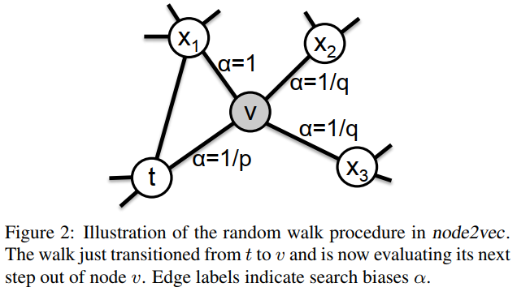

# node2vec
对图的遍历方式有两种算法，分别是深度优先搜索策略（DFS）和广度优先搜索策略（BFS），DeepWalk是典型的深度优先搜索策略。深度优先搜索就是从一个节点出发向更深更远离节点的方向进行搜索，而广度优先搜索策略则是优先访问完毕节点的邻居节点。node2vec是一种考虑了两种遍历方式的算法。用论文中的图来解释：  
  

假设游走策略刚刚从t走到了v，接下来将选择游走节点t、x1、x2、x3。其中，游走节点x2、x3则对应的是深度优先搜索，而t则对应的是返回参数，而x1则是广度优先搜索。

如图所示，根据t、x1、x2、x3与上一节点t之间的距离，来设定选择游走的偏置（p和q都是超参数），并进行游走节点的选择。因此，node2vec采用的是二阶随机游走。

在进行了游走后将游走策略使用SkipGram进行计算，就能获得embeddings，这一部分与DeepWalk相类似。
